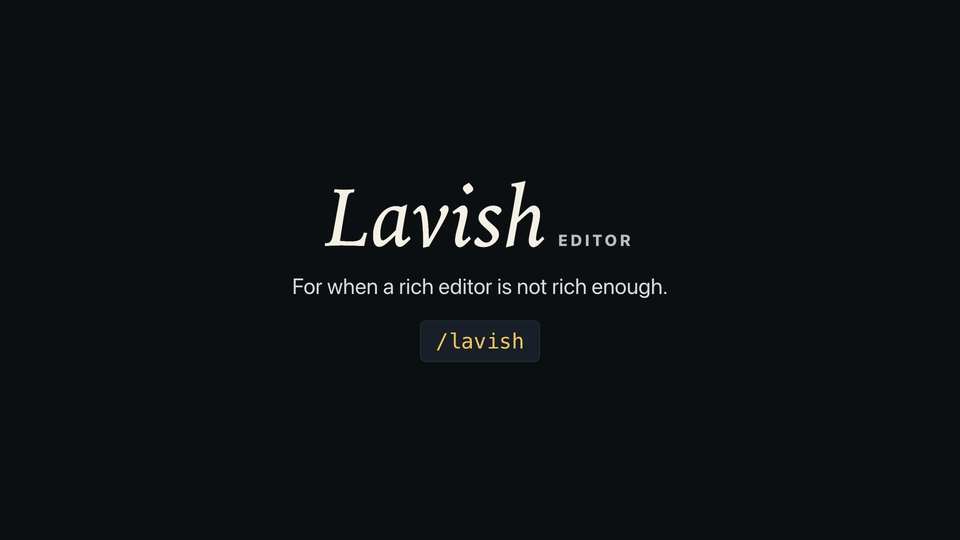

<h1 align="center">atelier-axi</h1>
<p align="center">
  <a href="https://github.com/knowttl/atelier-axi/actions/workflows/ci.yml"
    ></a>
  <a href="https://github.com/knowttl/atelier-axi/actions/workflows/release-please.yml"
    ></a>
  <a href="https://www.npmjs.com/package/atelier-axi"
    ></a>
  <a href="https://img.shields.io/badge/platform-macOS%20%7C%20Linux%20%7C%20Windows-blue?style=flat-square"
    ></a>
</p>

<h3 align="center">For when a rich editor is not rich enough.</h3>

<p align="center">
  
</p>

HTML is the new markdown. Atelier is the new editor for your HTML artifacts.

Agents are good at producing rich HTML artifacts, but the human-agent collaboration loop on such artifacts is lacking and falls back into screenshots and long responses for “tell me what to change.”
That loses the thing HTML is best at: interactivity.

Atelier Editor opens agent-generated HTML files in a local browser, lets you pinpoint elements, selected text, or Mermaid diagram nodes, edit rendered Mermaid diagrams as whiteboards, and send feedback to the agent to address.

- **Local-first** - Review local HTML artifacts with a local CLI and no cloud dependency in the core feedback loop; hosted sharing through third-party ht-ml.app is explicit and opt-in.
- **Human-AI collaboration** - Annotate elements, selected text ranges, and Mermaid diagram nodes, edit Mermaid diagrams as whiteboards, and send messages to the agent without leaving Atelier Editor.
- **Battery included** - Atelier Editor teaches your agent good visualization for common use cases such as product or technical plans, design explorations and more out of the box.

Atelier Editor is an [AXI](https://axi.md), which means -

- It's just a CLI any capable agent can run without setup.
- It's optimized for agent ergonomics. TOON output, long polling, and contextual disclosure making it highly token efficient.
- The skill and hooks below only handle discovery; agents learn to use the AXI by using it.

## Quick Start

Install the Atelier skill in the [Agent Skills](https://agentskills.io) format with [`npx skills`](https://github.com/vercel-labs/skills):

```sh
npx skills add knowttl/atelier-axi --skill atelier
```

That is the entire setup - no npm install needed.
The skill teaches your agent to run Atelier through `npx -y atelier-axi`, so the CLI comes along on demand.
In restricted subprocess sandboxes, CI, or agent harnesses where `npx -y` exits opaquely, the skill also documents direct installed-copy fallbacks through the local or global npm install path.
Its frontmatter also includes Hermes Agent metadata, so Hermes-compatible harnesses can categorize and surface it as a first-class productivity skill.
This installs the public `atelier` skill.
The repository also contains an internal `atelier-design` brand skill for maintainers; default `npx skills add ... --list` and skills.sh discovery hide it unless `INSTALL_INTERNAL_SKILLS=1` is set.

Then, in agents that expose skills as slash commands (Claude Code, for example), invoke it directly:

```
/atelier let's discuss our plan here
```

Or just ask for anything that is easier to grasp visually - a plan, comparison, diagram, table, code view, or report - and the agent loads the skill on its own when it recognizes the task.

By default the skill lands in the current project's skills directory (`.claude/skills/`, for example); add `-g` to install it for all projects (`~/.claude/skills/`).

## Other Ways to Use Atelier

The skill is the recommended path, but it is not the only one.

### Zero setup

Atelier is an AXI, so any capable agent can run the CLI directly with nothing installed at all.
Just tell your agent:

```
Use `npx -y atelier-axi` to write a product or technical plan for what we discussed.
```

### Session hook

Want Atelier's ambient context - including your live open sessions - fed into every agent session instead of loading on demand?
Install the CLI globally and opt into the hook:

```sh
npm install -g atelier-axi
atelier-axi setup hooks
```

This installs a `SessionStart` hook for **Claude Code**, **Codex**, **OpenCode**, and **GitHub Copilot CLI** that surfaces open sessions, visualization playbooks, and usage guidance at the start of each session.
Unlike the skill, the hook also shows your live open sessions, so a fresh agent session can resume an in-flight review.
**Restart your agent session after running this** so the new hook takes effect.

### Agent Plugin

Atelier also ships as an [Agent Plugin](https://agent-plugins.org) - the vendor-neutral packaging standard for skills and MCP servers - so clients that speak that format can load it directly.

**No marketplace is involved.** The installed npm package _is_ the plugin: `plugin.json` sits at the package root next to the `skills/` directory, so whatever `npm install` already put on disk is a complete, conformant plugin. Install the CLI, then register it:

```sh
npm install -g atelier-axi
atelier-axi setup plugin
```

That registers the installed package with every supported client it finds - **VS Code**, **Cursor**, and **GitHub Copilot CLI** - and reports which ones were absent. It is opt-in and idempotent, and it repairs the registered path after a reinstall or relocation. Reload each client afterward.

Each client is registered independently: one that cannot be registered is reported with what to do about it, and never blocks the others or fails the command.

To register by hand instead, point any client at the package directory (`npm root -g`/`atelier-axi`):

| Client             | Register with                                                                                                     |
| ------------------ | ----------------------------------------------------------------------------------------------------------------- |
| VS Code            | `"chat.pluginLocations": { "<package-dir>": true }` in user settings                                              |
| Cursor             | link the package dir at `~/.cursor/plugins/local/atelier-axi` (`setup plugin` handles Windows link compatibility) |
| GitHub Copilot CLI | `copilot plugin install <package-dir>` (or `copilot plugin install knowttl/atelier-axi` straight from the repo)   |

Codex and ChatGPT install plugins only from marketplace sources, so Codex users should use the session hook above instead.
Atelier declares no MCP server - the CLI itself is the agent interface - so a plugin install brings the same `atelier` skill, and the skill and plugin are alternatives rather than a stack.

### From source

```sh
git clone https://github.com/knowttl/atelier-axi.git
cd atelier-axi
pnpm install --frozen-lockfile
pnpm run build
pnpm link
```

## The Workflow

The whole loop runs locally — no account, no cloud, nothing to configure:

1. **Ask, or invoke `/atelier`.** Ask your agent for anything easier to grasp visually — a plan, comparison, diagram, table, code view, or report. The agent writes a self-contained HTML artifact (by default `.atelier/<name>.html` in your working directory).
2. **The agent runs `atelier-axi <file>`.** This spins up a local, loopback-only server on demand and opens the artifact in your browser. An open-time layout gate holds the page behind a curtain while the in-browser audit checks for a stable, proven severe layout failure.
3. **You review in the browser.** Flip on **Annotate** to pin feedback on any element, or select text to comment on an exact range. Queue as many notes as you like, chat with the agent, then **Send to Agent** — or **Send & End** to do both at once.
4. **The agent runs `atelier-axi poll <file>`.** It long-polls and stays silent until you send feedback or end the session, then returns your queued prompts as structured, token-efficient output. Browser-detected layout issues wait in the top-bar inbox and reach the agent only after you queue and send them; fatal failures that make the review surface unusable still return immediately.
5. **The agent revises and the page reloads.** It edits the same HTML file; Atelier live-reloads the browser and restores your scroll position. Repeat from step 3 until you are happy.
6. **End the session.** Click **End session** in the browser (or the agent runs `atelier-axi end <file>`). The detached server shuts itself down once nothing is connected.

```
┌───────────────┐
│ Agent writes  │
│ artifact.html │
└───────┬───────┘
        ▼
┌────────────────────────┐
│ atelier-axi <file_path> │
│ opens local browser UI │
└───────┬────────────────┘
        ▼
┌────────────────────────┐
│ Human annotates text   │
│ or elements, sends     │
│ chat, or queues layout │
│ issues from the inbox  │
└───────┬────────────────┘
        ▼
┌────────────────────────┐
│ atelier-axi poll waits  │
│ and returns prompts    │
│ the user queued        │
└───────┬────────────────┘
        ▼
   (agent revises →
    live reload →
    repeat or end)
```

### Wrapping up a finished review

Nothing forces a cleanup, so sessions and the shared server can linger long after a review is over. When you are done:

1. **End the session.** Click **End session** (or **Send & End**) in the browser, or have the agent run `atelier-axi end <html-file>`.
   An agent-initiated end still reopens on a plain `atelier-axi <html-file>`; a session you ended from the browser refuses a plain reopen and needs `--reopen`.
2. **Stop the shared server** once `atelier-axi` lists no other session: `atelier-axi stop`.
   This is prompt cleanup, not a requirement - the server already self-stops when the last session ends with nothing connected, or after `ATELIER_AXI_IDLE_TIMEOUT_MS` (default 30 minutes) with no browser or poll attached.
   When `ATELIER_AXI_IDLE_TIMEOUT_MS` is `0` or `off`, a manual stop can be required.
3. **Deleted the artifact already?** `end` fails with `ENOENT` and the session keeps showing as open even after the server stops, because sessions are keyed by the canonical file path.
   Recreate an empty file at that exact path, run `atelier-axi end <html-file>`, then delete it again. Ending sessions before deleting their artifacts avoids this entirely.
4. **Stop your own helpers separately.** A LAN port forwarder, SSH tunnel, or anything else you started alongside the server is a separate process Atelier never stops for you.
5. **Clear the leftovers.** Artifacts live under `.atelier/` in the working directory by default, with any `<name>.export.html` copies beside them.
   Whiteboard scene sidecars live under `<state-dir>/whiteboards/<key>/` and the last delivered poll batch at `<state-dir>/batches/<key>.json`, where `<state-dir>` is `~/.atelier-axi` by default or `ATELIER_AXI_STATE_DIR` when set, and `<key>` is the final segment of that session's URL; they are never removed automatically.

## How It Works

Under the hood, that loop is built from these pieces:

- **File-path identity** - Sessions are keyed by the canonical HTML file path, so agents do not need opaque IDs.
- **Portable artifacts** - The artifact runs in an iframe while Atelier injects a small SDK for annotations, snapshots, feedback controls, and render-time layout checks.
  Atelier does not inject any design system, so the saved HTML file renders identically whether you open it through `atelier-axi` or directly in a browser.
  Before writing HTML, choose a design system in strict priority order: follow a user-requested look first; otherwise inspect the project the artifact is about - the subject or product whose content or UI it represents, which may differ from your current working directory - and match that project's Tailwind or theme config, CSS variables or design tokens, component library, brand assets, or existing styled pages.
  If the artifact previews, proposes, or mocks a specific app's UI, render it in that app's own design system so it faithfully shows the product, even when you are running in a different repo.
  Only when both come up empty, run `atelier-axi design` for a copy-pasteable Tailwind CSS v4 + DaisyUI v5 CDN fallback, a content-to-playbook router, and Mermaid diagram tooling.
  That fallback guidance recommends DaisyUI's `luxury` theme by default, warns not to `@apply` DaisyUI classes inside Tailwind browser-runtime style blocks, includes an optional layout safety CSS snippet for dense nested grid/flex layouts, and provides a pinned, theme-aware Mermaid CDN snippet for flows, architecture, state, and sequence diagrams.
  The Mermaid snippet waits for page styles, chooses its light or dark rendering from the effective page background, and keeps diagrams in sync with page-theme and OS appearance changes.
- **Self-paint warning** - `atelier-axi <html-file>`, `export`, and `share` run a render-free check for artifacts missing an explicit page background and return a one-line `self_paint_warning`.
  The check fails open - any stylesheet link, `@import`, Tailwind runtime script, `color-scheme`, or `html`/`body`/`:root` background signal suppresses it - and it never blocks the open.
- **Open-time layout gate** - The browser chrome masks an artifact only while the real in-iframe audit waits for fonts and final geometry.
  The first completed check always reveals the artifact, whatever it found; the gate never holds the review hostage waiting for a repair.
  The user can click **Show anyway**, and a bounded safety timeout fails open when no check has completed.
- **Layout issues inbox** - Detection is passive. After fonts and finite animations settle, the injected SDK confirms severe failures from direct rendered evidence such as materially escaped meaningful content or required controls, clipped text fragments, viewport reachability, or near-total semantic occlusion.
  Explicit ellipsis and line clamp, standard visually hidden accessibility text, intentional scrollers or masks, parent overhang, generic element scroll geometry, decorative overlap, and uncertain motion do not produce findings by themselves.
  Proven failures are filed in a **Layout issues** button in the top bar, which is hidden while nothing is unresolved and otherwise shows the unresolved count.
  Its drawer lists each issue with severity, a plain-language explanation, the affected viewport, the target/component identity, when it was last seen, and its lifecycle state, plus per-issue **Reveal** (highlight it in the artifact) and **Dismiss** actions.
  Nothing is selected by default. The user picks issues (or **Select all**) and **Queue selected fixes** turns that whole group into one ordinary queued prompt, tagged `layout-warnings`, that reaches the agent through the normal feedback path when they send.
  Detection never returns `atelier-axi poll` and never wakes an agent; only the user queueing a fix does. The one exception is a fatal `artifact_failures` response, for failures that make the review itself unusable, such as the artifact document or one of its own local assets failing to load.
- **Layout issue lifecycle** - Each issue is identified by a stable fingerprint of the diagnostic rule, the normalized target identity, and the viewport class, so repeat detections update one record instead of inflating the count.
  `Open` means the latest completed check for its viewport still detects it. `Queued for fix` means the user asked for a repair - it stays unresolved and counted, and cannot be queued again while that request is outstanding.
  `Resolved` requires a newer successful artifact load plus a complete check at the same viewport that no longer detects it; it then leaves the count but keeps a bounded history.
  `Still present` (recurring) means a queued issue survived a newer revision, so it is selectable again with its earlier attempt retained. `Unverified` means a reload or check failed or was incomplete, so the prior issue was preserved rather than cleared. `Returned` means a resolved issue came back on a later revision.
  Dismissal applies only to the current artifact revision; a later revision surfaces the issue again if it is still detected. A check at one viewport never clears an issue found at another, and a viewport removed from the configured diagnostic set (`ATELIER_AXI_DIAGNOSTIC_VIEWPORTS`, default all) is marked obsolete with an explicit reason rather than reading as fixed.
- **Local assets** - Copy local images, CSS, fonts, and scripts next to the HTML artifact and reference them with relative paths from that directory; root-prefixed paths such as `/assets/logo.png` will not resolve through Atelier's artifact route.
- **Export and sharing** - `atelier-axi export` writes `<name>.export.html` by inlining local assets only, stripping the annotation SDK, and leaving remote CDN/font references as links that still need network access.
  `atelier-axi share` publishes the same local-inlined HTML to [ht-ml.app](https://ht-ml.app), a third-party hosting service not part of Atelier.
  Publishing sends the artifact to ht-ml.app's servers, public by default, or private and password-protected with `--password`; the response includes a secret `update_key` shown once for later management.
  Bundling never fetches remote URLs, local reads stay confined and size-capped, and absolute `file://` paths outside safe inlined asset references are redacted before output. Atelier's only response CSP is the review chrome's `frame-ancestors 'none'`; it does not constrain artifact content.
  Per-asset and per-bundle inline caps default to 10 MB and 25 MB, overridable with `ATELIER_AXI_EXPORT_MAX_ASSET_BYTES` and `ATELIER_AXI_EXPORT_MAX_BUNDLE_BYTES`.
  Unresolved local assets or export notices such as author-set CSP meta tags and redacted file URLs are surfaced in command or browser output.
  Use `--token` or `ATELIER_AXI_HTML_APP_TOKEN` for an optional bearer token; set `ATELIER_AXI_HTML_APP_API_URL` only when overriding the ht-ml.app API base.
- **Live reload** - Atelier watches the HTML artifact file by default and preserves the artifact iframe scroll position across reloads. To also reload on sibling asset changes, add `data-atelier-live-reload-root` to the root element or `<meta name="atelier-live-reload" content="root">`.
- **Feedback controls** - Native controls (radios, checkboxes, inputs, selects, buttons, labels, disclosure summaries, contenteditable) are interactive automatically, so they do not need `data-atelier-action`.
  For reversible choices, let option clicks update local state, then queue exactly one final answer from a per-question submit or Queue answer button with `window.atelier.queuePrompt()`.
  Mark only custom (non-native) clickable elements with `data-atelier-action` so Atelier does not annotate them, and use `data-atelier-question` or `queueKey` when pre-send updates for the same question should replace each other.
  Queued annotation preview pills and chat history share a scrollable Conversation panel above a sticky composer, so long feedback queues do not push the text box or send controls off screen.
  The browser chrome keeps editing actions in the overflow menu (copy path, reload artifact, copy DOM snapshot, export standalone HTML, publish link, end session), while the composer exposes **Send & End** beside **Send to Agent** to submit queued prompts and user-ended attribution together.
- **Keyboard shortcuts** - In the chrome composer, Enter sends queued prompts and Shift+Enter inserts a newline.
  In the annotation card, Enter queues the annotation, Shift+Enter inserts a newline, and Ctrl+Enter (Cmd+Enter on macOS) queues it and sends all queued prompts immediately.
  Cmd+I or Ctrl+I toggles between annotate and explore mode from either the browser chrome or the artifact iframe, including while focus is in a textarea or control.
- **Agent presence** - The browser shows when no agent is listening, shows a **Working...** bubble while the agent is applying delivered feedback, keeps queued feedback for the next successful `atelier-axi poll`, and preserves unresolved layout issues in the inbox across reloads.
  You can send at any time until the session ends, including while the agent is working: the answer is stored server-side and the agent's next poll picks it up.
  The no-timeout poll always writes an immediate stderr banner so it is visibly not hung; it adds the periodic stderr wait ticks only in an interactive terminal, so when stderr is piped (as under agent harnesses) the captured output carries no tick noise. Stdout always stays reserved for the final response; if the poll is interrupted or times out, re-run it because queued feedback is never lost.
  Agents keep the poll in the foreground by default; a background poll is supported only through a harness-native tracked job whose completion resumes or notifies the same agent.
  Each artifact supports at most one current poll owner; any competing poll exits with `POLL_SUPERSEDED` without draining queued feedback.
  Every delivered poll response ends with a `prompts_delivered=<N> batch_file=<path>` line, and the full structured response is written to that file first when possible.
  If the recovery copy cannot be written, the response is still delivered with `batch_file=-` rather than losing feedback that has already been removed from the session queue.
  Agent harnesses commonly cap captured output and keep the tail, which silently eats the head of a large batch; because a tail-keeping cap preserves the last line, an agent that parsed fewer prompts than `<N>` can tell the response was truncated and read the full batch from `batch_file` instead of asking you to answer again.
  Codex-specific guidance additionally warns that completed background tasks may not resume Codex automatically, so its poll should stay attached to the active turn.
- **Session end etiquette** - Atelier tracks who ended a session: a human clicking **End session** (or **Send & End**) in the browser is a user-initiated end, while `atelier-axi end <html-file>` is agent-initiated.
  A plain `atelier-axi <html-file>` after a user-initiated end refuses to reopen the browser and returns guidance instead; pass `--reopen` only when the user asks for further review or something important needs their visual attention.
  Agent-initiated ends keep reopening normally, same as before.
  `atelier-axi poll`'s `ended` response and the `feedback` response for the final batch before an end both carry `next_step` guidance telling the agent to stop polling and deliver remaining updates in chat instead of reopening.
- **Precise targets** - Text annotations include selected text plus range anchors, so agents are not limited to whole-element selectors.
- **Image attachments** - Attach reference images (PNG, JPEG, WebP) to an annotation by pasting, drag-dropping, or using the annotation card's **Attach image** picker; each shows a thumbnail chip with upload, remove, retry, and error states.
  Images are stored under the state dir and the queued prompt carries a server-generated absolute `path` and content-hash `id` (plus mime and dimensions) - never the raw bytes - so `atelier-axi poll` hands the agent a local file path to open.
  Limits are `ATELIER_AXI_MAX_ATTACHMENT_BYTES` (default 10 MiB per image), `ATELIER_AXI_MAX_ATTACHMENTS_PER_PROMPT` (default 4), and `ATELIER_AXI_MAX_PROMPT_ATTACHMENT_BYTES` (default 25 MiB per annotation); if any image is missing or any annotation breaches a count or byte cap, the entire send batch is rejected, the queue is preserved, and the reason is surfaced in the composer rather than silently dropping images.
  As a browser-side abuse guard, each chrome page allows 30 upload attempts per rolling minute, 4 uploads in flight at once, and 256 MiB of attempted image bytes over its lifetime; rejected uploads stay visible on their annotation card for retry or removal.
  Attachments are cleaned up by `ATELIER_AXI_ATTACHMENT_TTL_MS` (default 7 days; `0`/`off` disables) but only once no pending prompt still references them; `ATELIER_AXI_MAX_ATTACHMENT_DISK_MB` (default 512 MiB; `0`/`off` disables) caps total attachment disk.
  The cap is enforced when an image is uploaded, not just periodically: the upload first reclaims unreferenced files (oldest first, and never one added within the last hour), and if it still would not fit, that upload is refused with a storage-full error on its chip instead of discarding an image an annotation is about to send.
- **Mermaid diagrams** - The `atelier-axi design` Mermaid snippet matches diagram rendering to the effective artifact page background and re-renders when a page-theme or OS appearance change alters that appearance.
  In the Atelier browser, every rendered Mermaid diagram in a `.mermaid` container becomes an embedded editable Excalidraw whiteboard: click a diagram to unlock editing, use its Fullscreen action to edit it over the whole viewport, and scenes autosave locally.
  If a live reload changes the Mermaid source, the whiteboard shows that its edits are stale; reopening it lets the reviewer re-convert and discard the saved edits or keep editing the saved scene.
  Use **Queue feedback** to add a bounded edit summary plus local `.excalidraw` scene and PNG preview paths to the Conversation panel, then click **Send to Agent** to deliver it; the agent updates the artifact's Mermaid source, which remains authoritative.
  Flowchart, sequence, class, ER, and state diagrams convert to editable shapes; other diagram types are images that reviewers can draw and annotate.
  Rendered Mermaid SVGs outside `.mermaid` containers stay pannable and zoomable while you explore (drag to pan, scroll to zoom) and freeze for single-node annotation when you turn on annotation, sending the agent the diagram id, node id, and rendered label instead of just a CSS selector.
  Atelier changes only the browser view, so saved, standalone, and exported artifacts still render plain Mermaid.
- **Server cleanup** - The detached server stops after the last session ends when nothing is connected, or after `ATELIER_AXI_IDLE_TIMEOUT_MS` (default 30 minutes) with no browser or poll connections.
  Set `ATELIER_AXI_IDLE_TIMEOUT_MS=0` or `off` to disable idle self-shutdown.
- **Local-first state** - Session state stays under `~/.atelier-axi/` by default, or `ATELIER_AXI_STATE_DIR` when set.
- **Diagnostic viewports** - `ATELIER_AXI_DIAGNOSTIC_VIEWPORTS` sets which viewport classes the layout-issue inbox tracks (`mobile`, `compact`, `desktop`; comma-separated, default all). Warnings whose class leaves the set are marked obsolete with an explicit reason rather than reading as fixed.
- **Server port** - Set `ATELIER_AXI_PORT` to choose the server port; it defaults to `4387`.
- **Network binding** - The server binds to loopback (`127.0.0.1`) by default. Set `ATELIER_AXI_HOST` to bind elsewhere; a wildcard (`0.0.0.0` or `::`) binds every interface. Binding beyond loopback exposes an unauthenticated server that can read and serve arbitrary local files to anything that can reach it, so only do so on a trusted network. Set `ATELIER_AXI_LINK_HOST` to control the hostname written into generated session links (defaults to the bind address, or loopback when bound to a wildcard).
- **Allowed hosts** - To defend against DNS rebinding, the server rejects (`403`) any request whose `Host` header is missing or not one it answers to: the loopback names (`127.0.0.1`, `::1`, `localhost`), the configured bind and link host, and any bare IP literal except the wildcard/unspecified addresses `0.0.0.0` and `::`. IP literals are accepted without configuration because DNS rebinding needs a hostname the attacker controls in DNS, so an IP-literal `Host` can never be a rebound one - which keeps a LAN reviewer working when the loopback server is reached through a port forwarder or SSH tunnel (`Host: 192.168.1.5:4388`). Named hosts still need an opt-in: if you reach the server by a reverse-proxy hostname, an mDNS name, or any other name, list those in `ATELIER_AXI_ALLOWED_HOSTS` (whitespace-separated). Behind a reverse proxy, the forwarded `X-Forwarded-Host` is validated as a complete authority against the same rules, so add your public hostname there and have the proxy send it together with `X-Forwarded-Proto`. Set `ATELIER_AXI_ALLOWED_HOSTS` to `*` to disable the check entirely (only when the server sits behind your own authentication or proxy).
- **Browser opening** - Set `ATELIER_AXI_NO_OPEN=1`, equivalent to `--no-open`, to create or resume a session without launching a browser window.

## CLI Reference

| Command                          | Description                                                                                                                                                                                                                                                                                                                                                                                       |
| -------------------------------- | ------------------------------------------------------------------------------------------------------------------------------------------------------------------------------------------------------------------------------------------------------------------------------------------------------------------------------------------------------------------------------------------------- |
| `atelier-axi`                    | Show current sessions and usage guidance.                                                                                                                                                                                                                                                                                                                                                         |
| `atelier-axi update`             | Apply the latest npm release through the AXI SDK self-updater, then refresh the installed `atelier` skill via `npx -y skills update --yes atelier` (the skill installs separately, so a package upgrade alone never refreshes it). Pass `--check` to report current vs latest without installing or touching the skill.                                                                           |
| `atelier-axi <html-file>`        | Open or resume a Atelier Editor session, with the open-time layout gate enabled by default. Refuses to reopen a session the user explicitly ended from the browser unless `--reopen` is passed.                                                                                                                                                                                                   |
| `atelier-axi poll <html-file>`   | Long-poll until the user sends feedback or ends the session; detected layout issues wait in the user's Layout issues inbox and arrive only when the user queues them; keep the poll in the foreground unless a harness-native tracked job guarantees completion will resume or notify the same agent, and re-run interrupted polls. On `status: ended`, stop polling and do not reopen uninvited. |
| `atelier-axi end <html-file>`    | End a session as the agent; unlike a user-initiated end from the browser, this still allows a plain reopen later.                                                                                                                                                                                                                                                                                 |
| `atelier-axi export <html-file>` | Write a portable copy of the artifact: one HTML file with its local assets inlined, so it opens with no server and no sibling files. Remote CDN/font references are left as links.                                                                                                                                                                                                                |
| `atelier-axi share <html-file>`  | Publish the artifact (local assets inlined) to [ht-ml.app](https://ht-ml.app), a third-party host not part of Atelier, and print a visitable URL plus a secret update key; shares are public by default, and `--password` makes viewers enter the password before viewing.                                                                                                                        |
| `atelier-axi stop`               | Shut down the background server.                                                                                                                                                                                                                                                                                                                                                                  |
| `atelier-axi playbook [id]`      | List focused artifact guidance or show one playbook; agents must open each matching playbook before writing HTML.                                                                                                                                                                                                                                                                                 |
| `atelier-axi design`             | Show the Tailwind + DaisyUI CDN fallback, content-to-playbook router, theme-aware Mermaid diagram tooling, `luxury` default theme, DaisyUI `@apply` warning, and layout safety snippet.                                                                                                                                                                                                           |
| `atelier-axi setup hooks`        | Install or repair optional SessionStart hooks for Claude Code, Codex, OpenCode, and GitHub Copilot CLI; restart the agent session afterward.                                                                                                                                                                                                                                                      |
| `atelier-axi setup plugin`       | Register the installed package as an [Agent Plugin](https://agent-plugins.org) in VS Code, Cursor, and GitHub Copilot CLI; opt-in, idempotent, no marketplace involved. Reload each client afterward.                                                                                                                                                                                             |
| `atelier-axi server`             | Run the local Atelier Editor server.                                                                                                                                                                                                                                                                                                                                                              |

Known playbook IDs: `diagram`, `table`, `comparison`, `plan`, `code`, `input`, `slides`.
One artifact often combines several playbooks, such as a plan that includes a comparison and a diagram, so agents must match against each `use_when` trigger and open every matching playbook before writing HTML.
For flows, architecture, state, or sequence diagrams, open the diagram playbook and use the theme-aware Mermaid tooling from `atelier-axi design` unless SVG is needed for richly annotated nodes; avoid hand-built div/flexbox boxes-and-arrows.

**Feature planning.** Run `atelier-axi playbook plan` to plan a feature or change before building it: the agent surfaces every open question and edge case as an annotatable visual review surface first, converges with you, then writes a durable spec and a bite-sized implementation plan under `docs/atelier/<date>-<type>-<topic>/`. The full end-to-end pipeline lives inside the single `atelier` skill as two on-demand reference files — `planning.md` (drive the visual planning arc) and `implementing.md` (execute a finished `plan.md` with a fresh subagent per task) — so there is exactly one skill to invoke; it routes to the right mode based on the request.

### Flags

| Command                   | Flag                  | Description                                                                                                                                                                                                                            |
| ------------------------- | --------------------- | -------------------------------------------------------------------------------------------------------------------------------------------------------------------------------------------------------------------------------------- |
| `atelier-axi <html-file>` | `--no-open`           | Ensure the server/session exists without opening another browser window.                                                                                                                                                               |
| `atelier-axi <html-file>` | `--no-gate`           | Skip the open-time layout curtain for this browser open.                                                                                                                                                                               |
| `atelier-axi <html-file>` | `--reopen`            | Reopen a session the user explicitly ended from the browser; without it, a plain open refuses and explains why instead of reopening uninvited.                                                                                         |
| `atelier-axi update`      | `--check`             | Report current vs latest npm version without installing an update.                                                                                                                                                                     |
| `atelier-axi export`      | `--out <path>`        | Write the export to a specific path instead of `<name>.export.html` next to the source.                                                                                                                                                |
| `atelier-axi share`       | `--password <pw>`     | Make the third-party ht-ml.app page private; viewers must supply the password.                                                                                                                                                         |
| `atelier-axi share`       | `--token <t>`         | Attach an optional bearer token (`ATELIER_AXI_HTML_APP_TOKEN`); never required to publish.                                                                                                                                             |
| `atelier-axi poll`        | `--agent-reply "..."` | Show the agent's reply in the existing browser chat and re-enable human sends before polling again.                                                                                                                                    |
| `atelier-axi poll`        | `--timeout-ms <ms>`   | Test/debug escape hatch only; agents should normally omit it and leave the long poll running.                                                                                                                                          |
| `atelier-axi stop`        | `--port <port>`       | Shut down a server running on a non-default port.                                                                                                                                                                                      |
| `atelier-axi server`      | `--verbose`           | Log session and watcher events to stderr; can also be enabled with `ATELIER_AXI_DEBUG=1`. Detached server output is appended to `~/.atelier-axi/server.log` (or `ATELIER_AXI_STATE_DIR/server.log`) for startup and crash diagnostics. |

## Development

```sh
pnpm run check          # Run all verification commands
pnpm run build          # Bundle the publishable CLI, chrome, and design assets
pnpm run build:skill    # Regenerate the installable atelier skill
pnpm test               # Run node:test tests
pnpm run lint           # Run ESLint
pnpm run format:check   # Check Prettier formatting
pnpm run typecheck      # Run TypeScript checkJs validation
```
